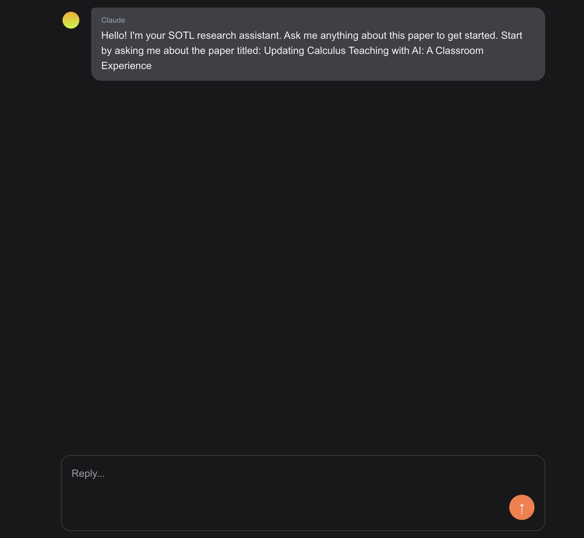

# SOTL Research Bot



## Overview

This application should provide a minimal interface to parse and chat with pdfs from CATLR's SOTL database.

## Project Structure

```
src/
├── app/
│   ├── [chatId]/
│   │   └── page.tsx
│   └── api/
│       ├── chat/
│       │   └── route.ts
│       └── paper/[paperId]/
│           └── route.ts
├── components/
│   ├── AnimatedTextArea.tsx
│   ├── ChatInput.tsx
│   ├── ChatMessageCard.tsx
│   ├── ChatPreviewCard.tsx
│   ├── ProjectHeader.tsx
│   └── ProjectKnowledge.tsx
├── layout.tsx
└── page.tsx
```

## Tech Stack

- **Frontend**: Next.js, React, TypeScript
- **Styling**: CSS (global styles)
- **Database**: Chroma DB (vector database)
- **APIs**: RESTful API endpoints

## Getting Started

### Prerequisites

- Node.js (v16 or later)
- Python (v3.8 or later)
- npm or yarn

### Installation

1. Clone the repository
   ```bash
   git clone [repository-url]
   cd [project-directory]
   ```

2. Install JavaScript dependencies
   ```bash
   npm install
   # or
   yarn
   ```
3. Create your ```.env``` file and configure environment variables
   ```bash
   ANTHROPIC_API_KEY=your_anthropic_api_key_here
   EXA_API_KEY=your_exa_api_key_here
   ```

5. Run development server
   ```bash
   npm run dev
   # or
   yarn dev
   ```

6. Open [http://localhost:3000](http://localhost:3000) in your browser

## Development

### File Structure Conventions

- React components are stored in `src/components/`
- API routes are defined in `src/app/api/`
- Page routes follow Next.js App Router convention in `src/app/`

### Scripts

- `npm run dev`: Start development server
- `npm run build`: Build the application
- `npm start`: Start production server
- `npm run lint`: Run ESLint

## Deployment

The application can be deployed using Vercel, Netlify, or any other platform that supports Next.js applications.

```bash
npm run build
npm start
```

## Contributing

1. Fork the repository
2. Create your feature branch (`git checkout -b feature/amazing-feature`)
3. Commit your changes (`git commit -m 'Add some amazing feature'`)
4. Push to the branch (`git push origin feature/amazing-feature`)
5. Open a Pull Request


